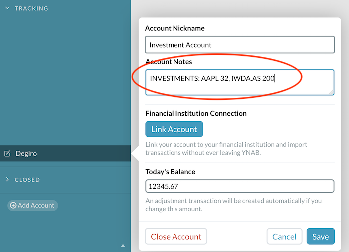

# sls-ynab-stock-updates

[](https://travis-ci.org/MatissJanis/sls-ynab-stock-updates)

Serverless function to automatically update investment account balances in YNAB.

## Setup
There are a few preliminary steps that must be taken to start using this serverless function.

1. Add information about your portfolio to the YNAB accounts you would like to be tracked.

  Format: `INVESTMENTS: {Stock Symbol} {Amount}, {Stock Symbol} {Amount}...`

  Example: `INVESTMENTS: AAPL 191, MSFT 120`

  

2. Create a `serverless.env.yml` environment variable file and copy the existing variables from the example file.

```sh
cp serverless.env.example.yml serverless.env.yml
```

3. Set the environment variables
  - `YNAB_API_TOKEN`: personal API token generated in the [YNAB homepage](https://app.youneedabudget.com/settings/developer).
  - `AUTOMATIC_APPROVAL`: should the automatic balance adjustment transactions be auto-approved? Useful to set this to `true` if you are running this function hourly/daily and don't want to go through streams of transactions.
  - `ALARM_EMAIL`: what email should be notified if the function starts malfunctioning and throwing errors?

4. Deploy the function
```sh
npm run deploy
```

## Requirements
- Node
- NPM

## Installation
```sh
npm install
```

## Development
1. Define necessary env variables in `serverless.env.yml` (example available in `serverless.env.example.yml`)

2. Run (to run locally)
```sh
npm start
```

## Deployment
If you wish to run this serverless function on a schedule (configured in `serverless.yml` file), then it must be deployed. This can be done by running the following command.

```sh
npm run deploy
```
